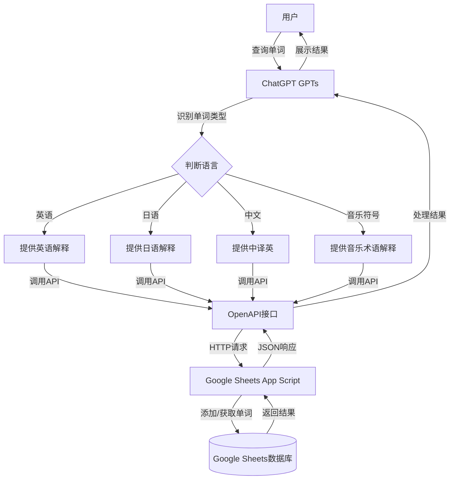

# ChatGPT 英语学习助手与单词管理系统

这是一个利用ChatGPT的GPTs功能结合Google Sheets来帮助用户学习英语词汇并管理单词本的系统。该系统通过OpenAPI调用Google Sheets脚本，实现单词的自动记录和复习功能。

## 系统概述

本系统主要包含三个部分：
1. Google Sheets 脚本 (App Script)
2. ChatGPT 提示词模板 (GPTs自定义指令)
3. OpenAPI 接口定义

系统流程图：



## 技术细节

### Google Apps Script 功能解析

1. **主入口函数 `doGet(e)`**
   - 处理所有HTTP GET请求
   - 解析请求参数（domain、user、action）
   - 根据参数动态确定要操作的工作表（`{domain}-{user}`格式）
   - 根据action参数调用对应的操作函数（add或get）

2. **添加单词函数 `addWords(e, sheet)`**
   - 接收单词列表（逗号分隔）并解析
   - 使用当前日期作为添加日期（格式：YYYYMMDD）
   - 检查单词是否已存在于工作表中
   - 对于新单词，添加到工作表并设置初始复习计数为0
   - 返回成功添加的单词和重复单词的列表

3. **获取单词函数 `getRecentWords(e, sheet)`**
   - 获取指定数量的待复习单词
   - 按最近复习日期排序（最旧的优先）
   - 从候选单词中随机选择指定数量
   - 更新所选单词的复习次数和最后复习日期
   - 返回所选单词的详细信息

4. **帮助函数**
   - `shuffleArray(array)`: 随机打乱数组元素顺序
   - `testDoGet()`: 测试API功能的模拟函数

### 系统交互流程

1. **ChatGPT → OpenAPI 交互**
   - ChatGPT根据用户查询识别单词和语言
   - 根据识别结果生成单词解释
   - 通过OpenAPI调用向Google Sheets发送单词存储请求
   - 查询参数包括：domain（语言域）、user（用户ID）、action（操作类型）、words（单词列表）

2. **OpenAPI → Google Apps Script 交互**
   - OpenAPI将ChatGPT的请求转换为HTTP GET请求
   - 请求发送到Google Apps Script部署的网络应用URL
   - 参数通过URL查询字符串传递给Apps Script

3. **Google Apps Script → Google Sheets 交互**
   - Apps Script根据参数找到对应的工作表
   - 执行相应的数据操作（添加或获取单词）
   - 更新工作表中的数据（新单词、复习次数、日期）
   - 返回操作结果的JSON响应

4. **数据流向**
   - 查询单词：用户 → ChatGPT → OpenAPI → Google Apps Script → Google Sheets → 用户
   - 存储单词：ChatGPT → OpenAPI → Google Apps Script → Google Sheets → ChatGPT → 用户
   - 获取复习单词：用户 → ChatGPT → OpenAPI → Google Apps Script → Google Sheets → ChatGPT → 用户

## 配置指南

### 1. Google Sheets 设置

1. **创建一个新的Google Sheets文档**
   - 为每个域名和用户创建对应的工作表，格式为：`{域名}-{用户}`
   - 例如：`English-A`、`Japanese-B`、`Music-A`等

2. **设置工作表结构**
   - 第一列：单词 (Word)
   - 第二列：复习次数 (ReviewCount)
   - 第三列：最后复习日期 (LastReviewDate)，格式为YYYYMMDD

3. **配置App Script**
   - 在Google Sheets中打开"扩展程序" > "Apps Script"
   - 将`google_sheets_APP_Script.txt`中的代码复制到编辑器中
   - 保存并部署为网络应用
     - 选择"新建部署"
     - 执行身份选择"以应用的身份运行"
     - 访问权限选择"所有人（甚至匿名）"
     - 点击"部署"，并记录生成的URL

### 2. OpenAPI 配置

1. **编辑OpenAPI定义文件**
   - 将`OpenAPI_format.txt`中的内容复制到您的OpenAPI编辑器中
   - 在URL路径中替换`{put the google sheet ID here}`为您的Google Sheet部署ID
   - 该ID是您部署App Script后获得的URL中的一部分：
     ```
     https://script.google.com/macros/s/{YOUR_DEPLOYMENT_ID}/exec
     ```

### 3. ChatGPT GPTs 配置

1. **创建新的GPT**
   - 登录[ChatGPT](https://chat.openai.com/)
   - 点击"探索"或"Create"来创建新的GPT

2. **配置指令**
   - 将`chatgpt prompt.txt`中的内容作为指令添加到GPT配置中
   - 可以根据需要修改指令，但保持核心功能不变

3. **设置API调用**
   - 在GPT配置中添加"Actions"
   - 导入您修改后的OpenAPI定义
   - 确保API端点URL正确指向您的Google Sheets脚本

## 使用方法

1. **启动对话**
   - 用户访问配置好的ChatGPT GPT
   - ChatGPT会询问用户身份（"orange"或"ringo"）

2. **查询单词**
   - 用户直接输入要查询的单词，例如"apple"
   - 系统自动识别单词语言类型并进行相应处理

3. **获取单词解释**
   - ChatGPT提供单词的详细解释，包括：
     - 发音
     - 定义和常见用法
     - 词源和构词分析
     - 例句
     - 相关词汇

4. **单词存储**
   - 查询的单词会自动添加到用户对应的Google Sheets工作表中
   - 如果单词已存在，则不会重复添加

5. **复习功能**
   - 用户可以通过特定指令获取待复习的单词
   - 系统会根据上次复习日期选择需要复习的单词
   - 复习后，系统会更新复习次数和最后复习日期

## API参数说明

### 添加单词 (add)
- `domain`: 领域 (English, Japanese, Music)
- `user`: 用户标识 (A, B)
- `action`: 操作类型 (add)
- `words`: 要添加的单词，多个单词用逗号分隔

示例：
```
https://script.google.com/macros/s/{YOUR_DEPLOYMENT_ID}/exec?domain=English&user=A&action=add&words=apple,banana
```

### 获取单词 (get)
- `domain`: 领域 (English, Japanese, Music)
- `user`: 用户标识 (A, B)
- `action`: 操作类型 (get)
- `count`: 要获取的单词数量（可选，默认为10）

示例：
```
https://script.google.com/macros/s/{YOUR_DEPLOYMENT_ID}/exec?domain=English&user=A&action=get&count=5
```

## 注意事项

1. **权限设置**
   - 确保Google Sheets脚本有适当的访问权限
   - 如果使用私人数据，考虑设置访问限制

2. **数据结构**
   - 保持工作表的列结构一致：单词、复习次数、最后复习日期
   - 不要手动修改工作表的数据格式

3. **API调用限制**
   - Google Apps Script有每日调用限制，注意避免超额使用
   - 建议添加错误处理和重试机制

4. **单词去重**
   - 系统会自动检测重复单词，避免多次添加相同单词
   - 但不会检测不同形式的同一单词（如单复数形式）

5. **用户认证**
   - 当前系统使用简单的用户标识方式
   - 如需更安全的认证，考虑添加OAuth或其他认证机制

6. **调试测试**
   - 使用`testDoGet()`函数测试API功能
   - 检查Google Apps Script的日志以排查问题

## 常见问题解决

1. **API调用失败**
   - 检查网络连接
   - 验证URL和参数格式是否正确
   - 查看Google Apps Script的执行日志

2. **单词未正确添加**
   - 确认工作表名称格式是否符合`{域名}-{用户}`
   - 检查单词参数格式是否正确（使用逗号分隔）

3. **获取单词失败**
   - 确认工作表中有足够的单词记录
   - 验证日期格式是否为YYYYMMDD

4. **ChatGPT未正确调用API**
   - 检查OpenAPI定义是否正确
   - 确认API参数与ChatGPT提示词中的描述一致

## 扩展与自定义

本系统设计为模块化架构，可以根据需求进行扩展和自定义。以下是一些扩展建议：

### 1. 添加新的语言域

系统支持扩展到其他语言或领域：

1. **创建新的工作表**
   - 按照`{新域名}-{用户}`格式创建工作表
   - 保持列结构一致：单词、复习次数、最后复习日期

2. **修改ChatGPT提示词**
   - 在ChatGPT指令中添加新语言的处理逻辑
   - 设计适合该语言特点的单词解释格式

3. **更新OpenAPI定义**
   - 在domain参数的enum列表中添加新域名

### 2. 增强功能拓展

1. **添加复习计划功能**
   - 修改`getRecentWords`函数，实现基于间隔重复算法的单词选择
   - 可以添加难度等级和下次复习日期字段

2. **添加单词分类功能**
   - 在工作表中添加分类列
   - 扩展API参数，支持按分类添加和获取单词

3. **整合语音功能**
   - 在ChatGPT中添加语音API的集成
   - 提供单词发音功能

4. **统计数据分析**
   - 添加新的API操作类型（如`stats`）
   - 实现复习进度、掌握率等统计功能

### 3. 自定义UI界面

1. **创建Web前端**
   - 使用HTML/CSS/JavaScript创建专用前端
   - 直接调用Google Apps Script API
   - 提供更丰富的用户界面和交互体验

2. **移动应用集成**
   - 开发移动应用集成此功能
   - 实现离线单词查询和同步功能

## 多语言支持

系统已内置对多语言的支持，特别是英语和日语，以下是不同语言模式的特点：

### 1. 英语模式 (English)

- **默认模式**，适用于英语词汇学习
- 提供详细的词源、词根分析
- 示例句子强调英语环境下的用法
- 工作表名称格式：`English-{用户}`

### 2. 日语模式 (Japanese)

- 适用于日语单词和汉字学习
- 提供假名读音（平假名/片假名）
- 包含常用例句和相关词组
- 可能包含汉字分解和词源说明
- 工作表名称格式：`Japanese-{用户}`
- 输出示例和日志消息会使用日语显示

```javascript
// 日本語メッセージ出力例
console.log("単語を追加しました: " + word);
console.log("復習回数: " + reviewCount);
```

### 3. 音乐符号模式 (Music)

- 针对音乐术语和符号的专门模式
- 提供符号含义和使用方法
- 包含不同国家/语言中的称呼
- 工作表名称格式：`Music-{用户}`

### 4. 语言自动识别

ChatGPT会根据用户输入自动判断语言类型：
- 英文单词 → 英语模式
- 日文单词/汉字 → 日语模式
- 中文输入 → 默认为中译英模式
- 音乐符号相关 → 音乐模式

这种自动识别让用户可以无缝切换不同语言的学习，而无需手动更改模式。 