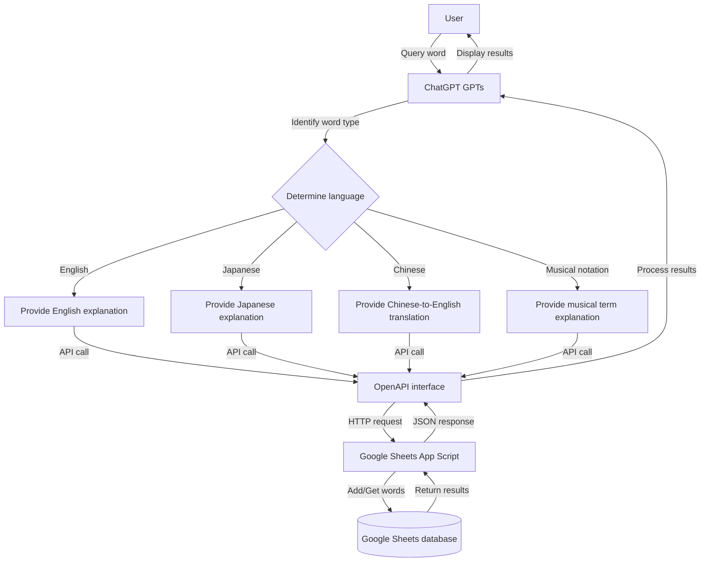

# ChatGPT English Learning Assistant and Vocabulary Management System

This is a system that utilizes ChatGPT's GPTs functionality combined with Google Sheets to help users learn English vocabulary and manage their word lists. The system uses OpenAPI to call Google Sheets scripts, enabling automatic word recording and review functions.

## System Overview

The system consists of three main components:
1. Google Sheets Script (App Script)
2. ChatGPT Prompt Template (GPTs Custom Instructions)
3. OpenAPI Interface Definition

System Flowchart:



## Technical Details

### Google Apps Script Function Analysis

1. **Main Entry Function `doGet(e)`**
   - Handles all HTTP GET requests
   - Parses request parameters (domain, user, action)
   - Dynamically determines which worksheet to operate on (`{domain}-{user}` format)
   - Calls the corresponding operation function (add or get) based on the action parameter

2. **Add Words Function `addWords(e, sheet)`**
   - Receives a comma-separated list of words and parses it
   - Uses the current date as the add date (format: YYYYMMDD)
   - Checks if words already exist in the worksheet
   - For new words, adds them to the worksheet and sets initial review count to 0
   - Returns a list of successfully added words and duplicate words

3. **Get Recent Words Function `getRecentWords(e, sheet)`**
   - Retrieves a specified number of words due for review
   - Sorts by most recent review date (oldest first)
   - Randomly selects a specified number from candidate words
   - Updates the review count and last review date for selected words
   - Returns detailed information about the selected words

4. **Helper Functions**
   - `shuffleArray(array)`: Randomly shuffles array elements
   - `testDoGet()`: Mock function for testing API functionality

### System Interaction Flow

1. **ChatGPT → OpenAPI Interaction**
   - ChatGPT identifies the word and language from user queries
   - Generates word explanations based on identification results
   - Sends word storage requests to Google Sheets through OpenAPI
   - Query parameters include: domain (language domain), user (user ID), action (operation type), words (word list)

2. **OpenAPI → Google Apps Script Interaction**
   - OpenAPI converts ChatGPT requests into HTTP GET requests
   - Requests are sent to the Google Apps Script deployed web app URL
   - Parameters are passed to Apps Script via URL query string

3. **Google Apps Script → Google Sheets Interaction**
   - Apps Script finds the corresponding worksheet based on parameters
   - Performs relevant data operations (adding or retrieving words)
   - Updates data in the worksheet (new words, review count, date)
   - Returns JSON response with operation results

4. **Data Flow**
   - Word Query: User → ChatGPT → OpenAPI → Google Apps Script → Google Sheets → User
   - Word Storage: ChatGPT → OpenAPI → Google Apps Script → Google Sheets → ChatGPT → User
   - Get Review Words: User → ChatGPT → OpenAPI → Google Apps Script → Google Sheets → ChatGPT → User

## Configuration Guide

### 1. Google Sheets Setup

1. **Create a New Google Sheets Document**
   - Create corresponding worksheets for each domain and user, format: `{domain}-{user}`
   - Examples: `English-A`, `Japanese-B`, `Music-A`, etc.

2. **Set Up Worksheet Structure**
   - First column: Word
   - Second column: ReviewCount
   - Third column: LastReviewDate, format YYYYMMDD

3. **Configure App Script**
   - Open "Extensions" > "Apps Script" in Google Sheets
   - Copy the code from `google_sheets_APP_Script.txt` into the editor
   - Save and deploy as a web app
     - Select "New deployment"
     - Choose "Execute as: App itself" for execution identity
     - Choose "Anyone (even anonymous)" for access permissions
     - Click "Deploy" and record the generated URL

### 2. OpenAPI Configuration

1. **Edit OpenAPI Definition File**
   - Copy the contents of `OpenAPI_format.txt` into your OpenAPI editor
   - Replace `{put the google sheet ID here}` in the URL path with your Google Sheet deployment ID
   - This ID is part of the URL you obtained after deploying App Script:
     ```
     https://script.google.com/macros/s/{YOUR_DEPLOYMENT_ID}/exec
     ```

### 3. ChatGPT GPTs Configuration

1. **Create a New GPT**
   - Log in to [ChatGPT](https://chat.openai.com/)
   - Click "Explore" or "Create" to create a new GPT

2. **Configure Instructions**
   - Add the contents of `chatgpt prompt.txt` as instructions to the GPT configuration
   - You can modify the instructions as needed, but maintain the core functionality

3. **Set Up API Calls**
   - Add "Actions" in the GPT configuration
   - Import your modified OpenAPI definition
   - Ensure the API endpoint URL correctly points to your Google Sheets script

## Usage Instructions

1. **Start Conversation**
   - Users access the configured ChatGPT GPT
   - ChatGPT will ask for the user's identity ("orange" or "ringo")

2. **Query Words**
   - Users directly input the word they want to look up, e.g., "apple"
   - The system automatically identifies the word language type and processes accordingly

3. **Get Word Explanations**
   - ChatGPT provides detailed explanations of the word, including:
     - Pronunciation
     - Definitions and common usage
     - Etymology and word structure analysis
     - Example sentences
     - Related vocabulary

4. **Word Storage**
   - Queried words are automatically added to the user's corresponding Google Sheets worksheet
   - If the word already exists, it will not be added again

5. **Review Function**
   - Users can retrieve words for review through specific commands
   - The system selects words for review based on the last review date
   - After review, the system updates the review count and last review date

## API Parameter Description

### Add Words (add)
- `domain`: Domain (English, Japanese, Music)
- `user`: User identifier (A, B)
- `action`: Operation type (add)
- `words`: Words to add, multiple words separated by commas

Example:
```
https://script.google.com/macros/s/{YOUR_DEPLOYMENT_ID}/exec?domain=English&user=A&action=add&words=apple,banana
```

### Get Words (get)
- `domain`: Domain (English, Japanese, Music)
- `user`: User identifier (A, B)
- `action`: Operation type (get)
- `count`: Number of words to retrieve (optional, default is 10)

Example:
```
https://script.google.com/macros/s/{YOUR_DEPLOYMENT_ID}/exec?domain=English&user=A&action=get&count=5
```

## Important Notes

1. **Permission Settings**
   - Ensure Google Sheets script has appropriate access permissions
   - Consider setting access restrictions if using private data

2. **Data Structure**
   - Maintain consistent column structure in worksheets: word, review count, last review date
   - Do not manually modify the worksheet data format

3. **API Call Limitations**
   - Google Apps Script has daily call limits, avoid excessive usage
   - Consider adding error handling and retry mechanisms

4. **Word Deduplication**
   - The system automatically detects duplicate words to avoid adding the same word multiple times
   - However, it does not detect different forms of the same word (such as singular and plural forms)

5. **User Authentication**
   - The current system uses a simple user identification method
   - Consider adding OAuth or other authentication mechanisms for more security

6. **Debugging and Testing**
   - Use the `testDoGet()` function to test API functionality
   - Check Google Apps Script logs to troubleshoot issues

## Common Problem Solutions

1. **API Call Failure**
   - Check network connection
   - Verify URL and parameter formats are correct
   - View Google Apps Script execution logs

2. **Words Not Added Correctly**
   - Confirm worksheet name format matches `{domain}-{user}`
   - Check word parameter format is correct (comma-separated)

3. **Word Retrieval Failure**
   - Confirm there are enough word records in the worksheet
   - Verify date format is YYYYMMDD

4. **ChatGPT Not Calling API Correctly**
   - Check OpenAPI definition is correct
   - Confirm API parameters match ChatGPT prompt description

## Extensions and Customization

This system is designed with a modular architecture that can be extended and customized according to needs. Here are some extension suggestions:

### 1. Adding New Language Domains

The system supports extension to other languages or domains:

1. **Create New Worksheets**
   - Create worksheets following the `{new domain}-{user}` format
   - Maintain consistent column structure: word, review count, last review date

2. **Modify ChatGPT Prompts**
   - Add processing logic for new languages in ChatGPT instructions
   - Design word explanation formats suitable for the characteristics of the language

3. **Update OpenAPI Definition**
   - Add new domain names to the enum list in the domain parameter

### 2. Enhanced Feature Extensions

1. **Add Review Planning Functionality**
   - Modify the `getRecentWords` function to implement word selection based on spaced repetition algorithms
   - Add difficulty level and next review date fields

2. **Add Word Classification Functionality**
   - Add classification columns to worksheets
   - Extend API parameters to support adding and retrieving words by category

3. **Integrate Voice Functionality**
   - Add voice API integration in ChatGPT
   - Provide word pronunciation features

4. **Statistical Data Analysis**
   - Add new API operation types (e.g., `stats`)
   - Implement statistics on review progress, mastery rate, etc.

### 3. Custom UI Interface

1. **Create Web Frontend**
   - Create a dedicated frontend using HTML/CSS/JavaScript
   - Directly call the Google Apps Script API
   - Provide richer user interface and interaction experience

2. **Mobile App Integration**
   - Develop mobile applications to integrate this functionality
   - Implement offline word lookup and synchronization features

## Multilingual Support

The system has built-in support for multiple languages, especially English and Japanese. Here are the characteristics of different language modes:

### 1. English Mode (English)

- **Default mode**, suitable for English vocabulary learning
- Provides detailed etymology and root analysis
- Example sentences emphasize usage in English environments
- Worksheet name format: `English-{user}`

### 2. Japanese Mode (Japanese)

- Suitable for Japanese words and kanji learning
- Provides kana readings (hiragana/katakana)
- Includes common example sentences and related word groups
- May include kanji breakdown and etymology explanations
- Worksheet name format: `Japanese-{user}`
- Output examples and log messages will be displayed in Japanese

```javascript
// 日本語メッセージ出力例
console.log("単語を追加しました: " + word);
console.log("復習回数: " + reviewCount);
```

### 3. Music Notation Mode (Music)

- Specialized mode for music terms and symbols
- Provides symbol meanings and usage methods
- Includes terminology in different countries/languages
- Worksheet name format: `Music-{user}`

### 4. Automatic Language Recognition

ChatGPT automatically determines language type based on user input:
- English words → English mode
- Japanese words/kanji → Japanese mode
- Chinese input → Default to Chinese-to-English translation mode
- Music symbol related → Music mode

This automatic recognition allows users to seamlessly switch between learning different languages without manually changing modes. 